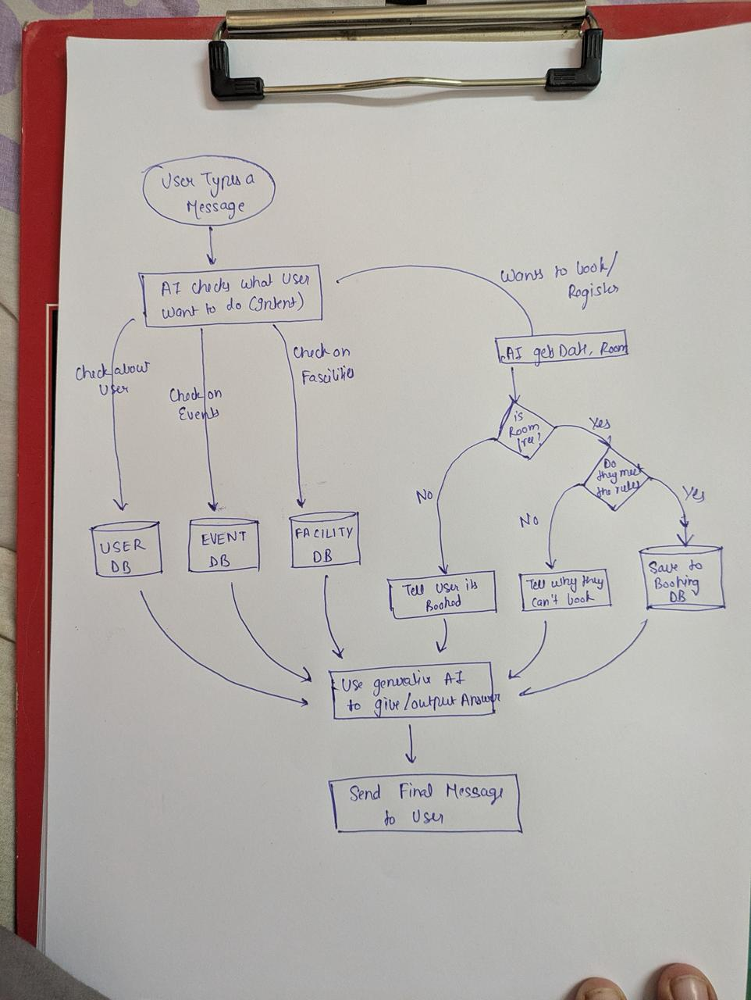

# Campus AI Chatbot

A simple, intelligent AI agent designed to help college students find event information, check campus rules, and book lab rooms safely.

This project was built to demonstrate how an AI can handle different types of user requests—from simple information retrieval to executing strict, rule-based database transactions

## Features

- **Smart Intent Recognition:** Automatically determines if a user wants to know about events, campus facilities, or make a booking.
- **Information Retrieval:** Fetches real-time data from campus databases to answer questions about library hours or upcoming seminars.
- **Safe Booking System:** Extracts dates, times, and room numbers to check availability before making any changes to the database.

## System Architecture

The system follows a straightforward, linear flow:

1. **User Input:** The chatbot receives a natural language message.
2. **Intent Routing:** The AI decides which database to query.
3. **Information Path:** Directly retrieves rules/events and drafts a response.
4. **Action Path:** Extracts booking details, checks availability/rules before saving to the SQL ledger.

## Tech Stack

This project was built with beginner-friendly, industry-standard tools:

- **Language:** Python 3.10+
- **AI Core:** OpenAI API (`gpt-3.5-turbo` or `gpt-4o-mini`)
- **Web Framework:** Flask (Lightweight backend routing)
- **Databases:** \* **SQLite:** For handling relational booking data securely.
  - **MongoDB:** For flexible, document-based storage of campus events.
